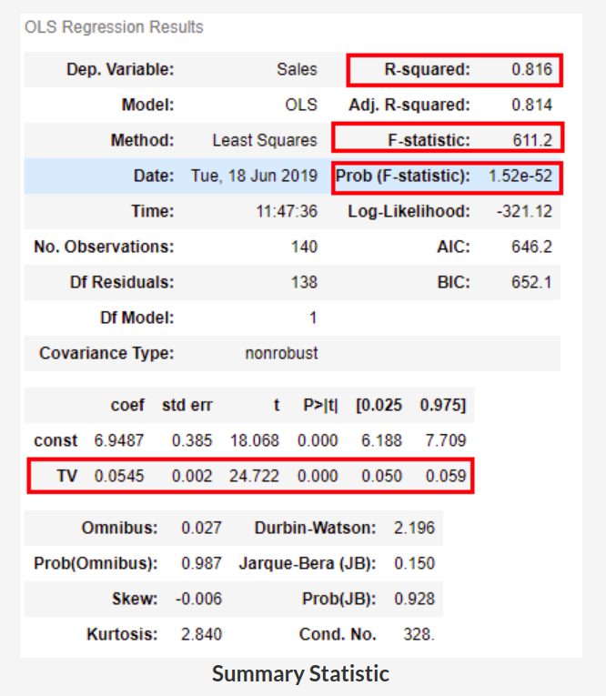
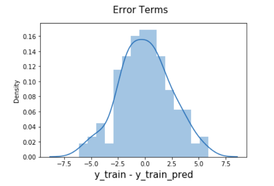
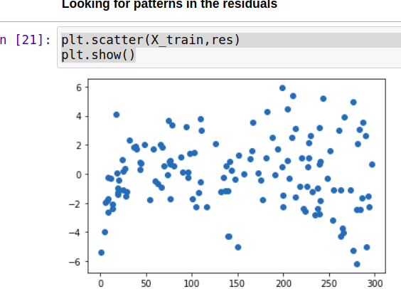

## Regression

### What?
- we have 1 continuous target variable whose value depends on other independent variables

## Simple Linear Regression steps (Statsmodel)
### 1. Read and understand data
### 2. Visualize data
- sns.pairplot(advertising, x_vars=['TV', 'Newspaper', 'Radio'], y_vars='Sales',size=4, aspect=1, kind='scatter')
plt.show()
- sns.regplot(x='feature', y='target', data=df)
- sns.heatmap(advertising.corr(), cmap="YlGnBu", annot = True)

### 3. Build model

- create x and y
- create train and test sets
  ```buildoutcfg
  from sklearn.model_selection import train_test_split
  X_train_lm, X_test_lm, y_train_lm, y_test_lm = train_test_split(X, y, train_size = 0.7, test_size = 0.3, random_state = 100)
  ```
- train model on training set
  - we will use OLS (ordinary least squares)
    ```buildoutcfg
    import statsmodels.api as sm
    X_train_sm = sm.add_constant(X_train)
    lr = sm.OLS(y_train, X_train_sm)
    lr_model=lr.fit()
    ```
- summary statistic
  ```buildoutcfg
  lr.summary()
  ```
  
  
  - **R2** - value 0.816 tells 81 % of the variance is captured
  - **F-statistic** - tells whether value of beta is significant,The basic idea behind the F-test is that it is a relative comparison between the model that you've built and the model without any of the coefficients except for
 . If the value of the F-statistic is high, it would mean that the Prob(F) would be low and hence, you can conclude that the model is significant. On the other hand, if the value of F-statistic is low, it might lead to the value of Prob(F) being higher than the significance level (taken 0.05, usually) which in turn would conclude that the overall model fit is insignificant and the intercept-only model can provide a better fit
  - **Prob (F-statistic)** - is less than 0.05, you can conclude that the overall model fit is significant. If it is greater than 0.05, you might need to review your model as the fit might be by chance
  - **P Value** - less than 0.05, beta is significant(our null hypothesis is that beta is insignificant, lower p, greater chances to reject null hypothesis), p-value of the coefficients just tells you about the significance of a particular coefficient. It does not shed any light on the significance of the overall model fit
  - **T value** higher the t value smaller p value
  - **Standard error** is the sample's standard deviation, (population standard deviation / root(sample size))

- evaluate model (training set, test set)

  - On training data
  ```buildoutcfg
     plt.scatter(X_train, y_train)
     plt.plot(X_train, 6.948 + 0.054*X_train, 'r')
     plt.show()
  ```

### 4. Residual analysis (Verify assumptions)
  - check if errors are normally distributed
    ```
    y_train_pred = lr.predict(X_train_sm)
    res = (y_train - y_train_pred)
     
    fig = plt.figure()
    sns.distplot(res, bins = 15)
    fig.suptitle('Error Terms', fontsize = 15)                  # Plot heading 
    plt.xlabel('y_train - y_train_pred', fontsize = 15)         # X-label
    plt.show() 
    ```
  
  
  - check error variance and whether they are independent
    - 
 
### 5. Predictions and evaluations on test set
- Predict on test set
  ```buildoutcfg
  # Add a constant to X_test
  X_test_sm = sm.add_constant(X_test)
  
  # Predict the y values corresponding to X_test_sm
  y_pred = lr.predict(X_test_sm)
  ```
- Evaluate model (r2_score, MSE)
  ```buildoutcfg
  np.sqrt(mean_squared_error(y_test, y_pred))
  r2_score(y_test, y_pred)
  ```
  
## Linear Regression using SKLearn

### 1. Create model object
```buildoutcfg
from sklearn.model_selection import train_test_split
X_train_lm, X_test_lm, y_train_lm, y_test_lm = train_test_split(X, y, train_size = 0.7, test_size = 0.3, random_state = 100)

X_train_lm = X_train_lm.values.reshape(-1,1)
X_test_lm = X_test_lm.values.reshape(-1,1)

lm = LinearRegression()
```
### 2. Fit the model
```buildoutcfg
lm.fit(X_train_lm, y_train_lm)
```
### 3. See parameters, make predictions
```buildoutcfg
print(lm.intercept_)
print(lm.coef_)

# make predictions
y_pred_train = lm.predict(X_train_lm)
y_pred_test = lm.predict(X_test_lm)
```
### 4. Evaluate (r2, mse, etc)
```buildoutcfg
print(r2_score(y_train_lm, y_pred_train))
print(r2_score(y_test_lm, y_pred_test))
```
## Scaling
- MinMax Scaling
  - Value's range is converted from 0 to 1
- Standard Scaling
  - Subtract mean and divides standard deviation, convert's standard deviation to 1
- Model's statistics and goodness of fit remain unchanged, so why use it ?
  - faster conversion

## General questions

### 1. Why it is named as r_squared ?
Name is r_square beacuse it is the square of correlation co-efficient

### 2. Is RMSE any good ?
RMSE is not a normalized value, it's value depends on y's scale, if y is in thousands this value will be huge
It can be used to compare two models

### Correlation coefficient value lies between -1 to 1, remember it cannit be even -1.0087

## Multi Linear Regression steps (Statsmodel)
### 1. Understand data
    - df.head(), df.shape, df.info(), df.describe()
### 2. Visulaize numerical relationships
    - sns.pairplot(df)
    - sns.heatmap(advertising.corr(), cmap="YlGnBu", annot = True)
### 3. Visulaize categorical to numerical relationships
```buildoutcfg
plt.figure(figsize=(20, 12))
plt.subplot(2,3,1)
sns.boxplot(x = 'mainroad', y = 'price', data = housing)
plt.subplot(2,3,2)
sns.boxplot(x = 'guestroom', y = 'price', data = housing)
plt.subplot(2,3,3)
sns.boxplot(x = 'basement', y = 'price', data = housing)
plt.subplot(2,3,4)
sns.boxplot(x = 'hotwaterheating', y = 'price', data = housing)
plt.subplot(2,3,5)
sns.boxplot(x = 'airconditioning', y = 'price', data = housing)
plt.subplot(2,3,6)
sns.boxplot(x = 'furnishingstatus', y = 'price', data = housing)
plt.show()
```
###4. Preparing the data for modelling
- convert yes, no to 0 and 1 (2 categories)
```buildoutcfg
varlist =  ['mainroad', 'guestroom', 'basement', 'hotwaterheating', 'airconditioning', 'prefarea']

# Defining the map function
def binary_map(x):
    return x.map({'yes': 1, "no": 0})

# Applying the function to the housing list
housing[varlist] = housing[varlist].apply(binary_map)
```
- encode multi-category variables using pd.get_dummies
```buildoutcfg
status = pd.get_dummies(housing['furnishingstatus'], drop_first = True)
housing = pd.concat([housing, status], axis = 1)
housing.head()
```
###5. Perform the test-train split and scale the features
```buildoutcfg
from sklearn.model_selection import train_test_split

# We specify this so that the train and test data set always have the same rows, respectively
np.random.seed(0)
df_train, df_test = train_test_split(housing, train_size = 0.7, test_size = 0.3, random_state = 100

from sklearn.preprocessing import MinMaxScaler
scaler = MinMaxScaler()
num_vars = ['area', 'bedrooms', 'bathrooms', 'stories', 'parking','price']
df_train[num_vars] = scaler.fit_transform(df_train[num_vars])
```
###6. Visulaize co-relations
```buildoutcfg
plt.figure(figsize = (16, 10))
sns.heatmap(df_train.corr(), annot = True, cmap="YlGnBu")
plt.show()
```
###7. Build model
- Starting with 1 variable (may not be the best idea always)
    - ```buildoutcfg
        y_train = df_train.pop('price')
        X_train = df_train
      
        import statsmodels.api as sm

        # Add a constant
        X_train_lm = sm.add_constant(X_train[['area']])
      
        # Create a first fitted model
        lr = sm.OLS(y_train, X_train_lm).fit()
        lr.params
        
        # Let's visualise the data with a scatter plot and the fitted regression line
        plt.scatter(X_train_lm.iloc[:, 1], y_train)
        plt.plot(X_train_lm.iloc[:, 1], 0.127 + 0.462*X_train_lm.iloc[:, 1], 'r')
        plt.show()
      ```
- Add all variables and remove 1 by 1
    - Reject variables whose p value is more than 0.05
    - High P, High VIF --> remove
    - High P, Low VIF --> remove these first
    - Low P high VIF --> remove after above ones
    - low P, low VIF --> don't remove
    - Always drop variables one by one, because when we remove 1 other's VIF will change

###8. Residual analysis
```buildoutcfg
fig = plt.figure()
sns.distplot((y_train - y_train_price), bins = 20)
fig.suptitle('Error Terms', fontsize = 20)                  # Plot heading 
plt.xlabel('Errors', fontsize = 18)     
```
###9. Make predictions on test set
- remember we don't learn anything on the test dataset, in scaling we only use transforma and not fit_transform
```buildoutcfg
# same preprocessing steps needs to be done on test set
num_vars = ['area', 'bedrooms', 'bathrooms', 'stories', 'parking','price']
df_test[num_vars] = scaler.transform(df_test[num_vars])

y_test = df_test.pop('price')
X_test = df_test

X_test_m4 = sm.add_constant(X_test)

X_test_m4 = X_test_m4.drop(["bedrooms", "semi-furnished", "basement"], axis = 1)
y_pred_m4 = lr_4.predict(X_test_m4)
```
###10. Evaluate model
- use R2 score

###11. Recursive feature elimination
```buildoutcfg

# Importing RFE and LinearRegression
from sklearn.feature_selection import RFE
from sklearn.linear_model import LinearRegression

lm = LinearRegression()
lm.fit(X_train, y_train)

rfe = RFE(lm, 10)             # running RFE
rfe = rfe.fit(X_train, y_train)

# view co-efficients
list(zip(X_train.columns,rfe.support_,rfe.ranking_))

# using sklearn now
col = X_train.columns[rfe.support_]
X_train_rfe = X_train[col]

# Adding a constant variable 
import statsmodels.api as sm  
X_train_rfe = sm.add_constant(X_train_rfe)
lm = sm.OLS(y_train,X_train_rfe).fit()   # Running the linear model
print(lm.summary())
```

